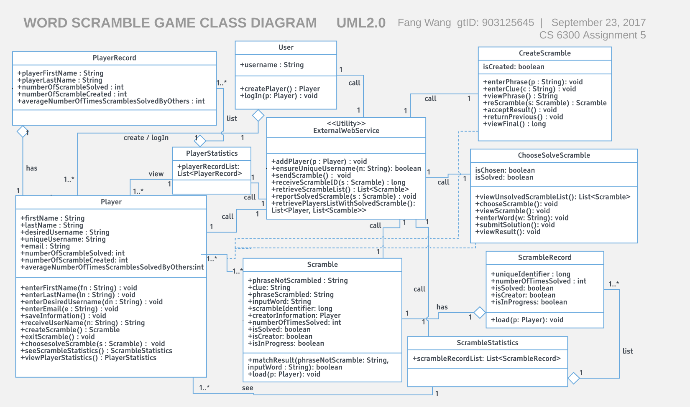
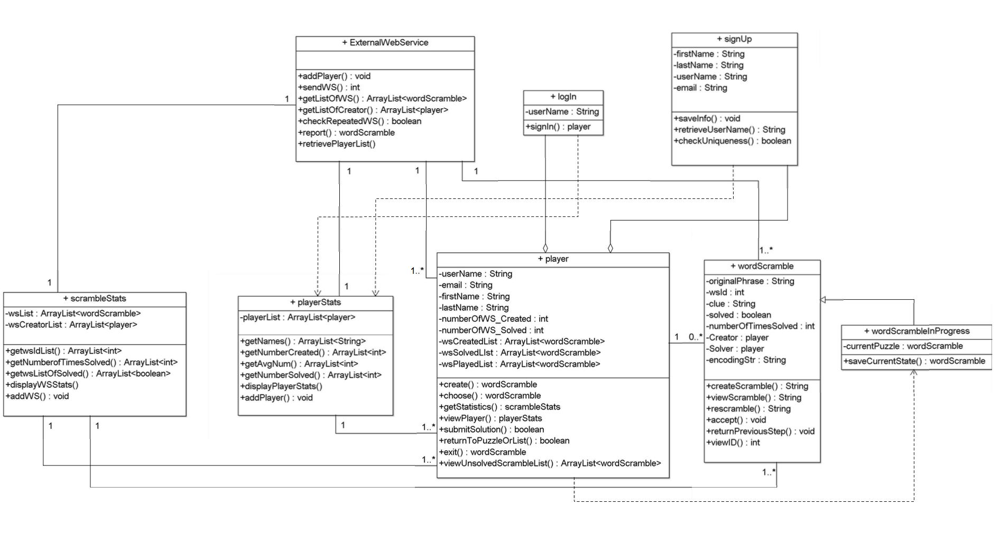
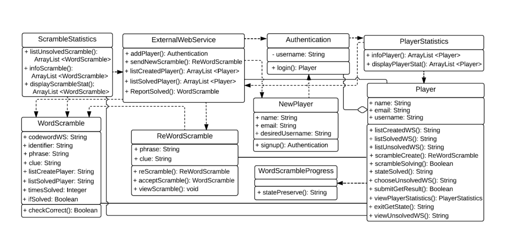
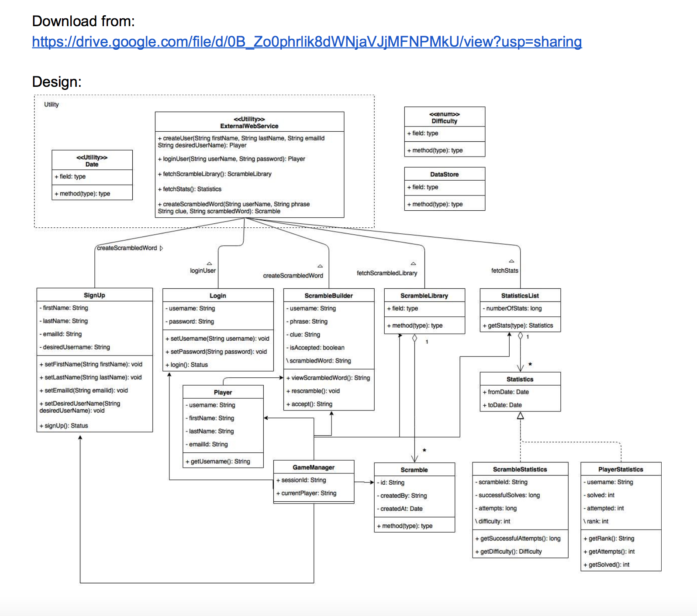

## Design 1

**pros:**

  * It meets all the requirements by using eight classes and two association classes. The design is easy to read and follow. Attributes and operations of a class have been listed. All the classes are well established to show their cohension. The main relationship between classes has been displayed. Multiplicity is shown between all the relations.
  * It has clear flow to generate statictics for scramble and player: the Scramble class has a ScrambleRecord for each player and a list of ScrambleRecord will generate a ScrambleStatistics for a player. Similar flow for Player, PlayerRecord and PlayerStatistics is shown in the design.

**cons:**

  * The link between player and scrambles seems relatively weak. The attribute named isSolved is to determine whether scramble belongs to a specific player so that every scramble has to be calculated if it belongs to the player, resulting in low efficiency. The efficiency can be improved by importing scrambles list including playing, created, solved to player class.
  * ChooseSolveScramble: these are not the responsibilities of the same class. It should be split into two.
  * load(p:Player) operation should build an aggregation relationship between Player and Scramble.
  * External web service(EWS) should be an association class between two other classes. For example, user creates player, EWS has been working for adding player during this connection.

## Design 2

**pros:**  

  * Identified a reasonable set of classes with the corresponding attributes and operations. Identified supported relationships between classes. 
  * In this design, createScramble and rescramble operation of WordScramble will be called by a player. player can rescramble WordScramble until satisfied. Only after they accept the result, the scramble ID will be assigned. Only scrambles with ID can be imported into player's record and scramble Lists. This design idea meets the requirement of Scramble can be reScrambled during creation process. After that the scramble phrase is fixed.
  * It is a good idea to have both Login and Signup class for clear logic flow and WordScrambleProgress is also necessary to have to meet the requirement of saving scramble in progress state for a player.

**cons:**

  *  The relationships between class login and class player, class signUp and class player: login  and signUP should be two association classes. It should have another class, which can have signup and login operations.
  * WordScramble class:  this class has attribute Solver (type: Player) and solved (type: boolean). As we know, WordScramble can be solved by different players. The Solvers can be multiple players instead of a single Player. The solved attribute is also associated with player.   
  * Although the design concept (see pros 2) is good, the UML diagram  did not classify the final scramble (which cannot be re-scrambled) and temporary scramble (which can be re-scrambled).

## Design 3

**pros:**

  * This design has 9 classes, which includes most of the classes/attributes/operations defined in the initial specifications.
  * It was awesome idea to separate out Scramble into WordScramble and ReWordScramble, similarly for Player and NewPlayer. This will clarify final scramble and temporary scramble during the process of create new scramble.

**cons:**

  * Some of WordScramble's attributes might not be right for the type. For example, listSolvedPlayer should be a Player type or a List of Player. The class Player has similar problems.
  * ReWordScramble could be replaced by a association class CreateScramble with relative operations and attributes.
  * Player Statistics should not directly contain the aggregation of Player Object, similarly for Scramble statistics and Scramble.  Scramble statistics and Player Statistics should contain attributes.  

## Design 4

**pros:**

  * Very digestible and easy to read. Relationships are clear and concise.
  * It has a class GameManager, which controlled everything. This makes the logic flow all start from the GameManager. Easy to follow.  

**cons:**

  * The external web service (EWS) has been designed to do more work than expected. EWS is a black box provided for certain remote (not limited to local device's game) data, so that we can input our data and retrieve a VERY limited set of info from it.  It cannot be used to createScrambleWord. EWS can only help to retrieve a Scramble ID after it is created.
  * class StatisticsList does not have a List type attribute. 
  * Signup and login should be two operation classes. For example, class A signup class B. class A login class B. It seems not clear about A and B.

## Team Design

#### Comparisions: Team design and Individual ones.

**main   commonalities**
1. Compared with design 1, the team design has the following commonalities.
   * Keeps all the classes of design 1. The attributes and operations of classes are almost the same. Relationship between classes are similar.
   * Both designs are using two association classes. One is to create scramble and the other one is to solve scramble.
   * Keeps the idea of scramble has a ScrambleRecord for each player and ScrambleStatistics of a player is a list of ScrambleRecord.
2. Compared with design 2, the team design has the following commonalities:
   * EWS is one of the centers for data communication within classes.
   * Keep a record of in-progress scramble for each individual player and individual scramble, which saves the state of scramble for future use.
   * The attributes to implement are similar, but in team design some methods are in different classes.
   * The function design in design 2 are similar to team design.
3. Compared with design 3, the team design has the following commonalities:
   * Player has the same attributes and Player has the operations like createScramble(), choosesolveScramble() and so on.
   * EWS has similar operations and Scramble has Similar attributes.
   * Both design have InProgressScramle class in order to save the retrieve previous states for multi-users.
4. Compared with design 4, there are four main commonalities:  
   * Representation of PlayerStatistics used in final design is similar to design 4.
   * Representation of Scramble and ScrambleList and ScrambleStatistics are similar to design 4.
   * Player class has similar attributes as design 4, however operations are different.
   * CreateScramble of final design is similar to ScrambleBuilder of design 4. Its a bit more refined in final design though.

**differences**

1. The main differences for design 1:
   * ExternalWebService has five operations and these makes it becomes an association class between User and Player, Player and Scramble, ScrambleList and Scramble, SolvedScrambleList and Scramble, CreatedScrambleList and Scramble. Class ScrambleList, class SolvedScrambleList, and class CreatedScrambleList does not exists in design 1. These three classes has player attribute, which means they are associated with player.  In design 1, the role of EWS is not clear.
   * To meet the requirement of saving the scramble state in progress for a player,  design 1 uses isInProgress, inputWord attributes and a load(p: player) operation for the class Scramble. In team design, class Scramble has no player involvement because all players should be able to access the same Scramble and try to solve it if it is unsolved by this player. Two new classes InProgressScramble and inProgressScrambleList has been added. These two classes includes an attribute player, which is a Player type.
   * chooseSovleScramble operation for class Player has been split into chooseScramble and solveScramble comparing with design 1 and team design. This is because chooseScramble is "player choose from unSolvedScrambeList", and sovleScramble is "player solve scramble". They have two different objects to work on.
2. The main differences for design 2 and team design:
   * Instead of using logIn and signUP classes to log in or register in desgin 2, team design uses two methods to implement it.
   * Instead of no association class in design 2, association classes are introduced in team design.
   * Design 2 uses Player class as the class to implement scramble classes and register for data, but in team design, these two functions are implemented by several different classes: player, unSolvedScrambeList, Scramble.
   * In design 2, scramble lists are stored as scramble Lists in player class for personal record and in scrambleStats class, whereas in team design, the records of scramble are stored in ScrambleRecord and ScrambleStatistics as record list, which is more efficient to implement. 
3. There are three main differences between team design and design 3:  
   * Team design has two operations classes: ChooseSolveScramble and CreateScramble, (like Checkout operation class mentioned in the lecture.) ChooseSolveScramble and CreateScramble classes have their corresponding methods. These two operation classes make the functions of solving scramble and creating scramble clear.
   * Team design has two classes named ScrambleRecord and PlayerRecord. ScrambleRecord/PlayerRecord are classes which include all information required from ScrambleStatistic/PlayerStatistic but they are only for one scramble/player. In this way, the ScrambleStatistics/PlayerStatistics are the list of ScrambleRecord/PlayerRecord.
   * There are total five lists regarding about scramble: ScrambleList,  SolvedScrambleList, CreatedScrambleList, UnsolvedScrambleList which also includes a InProgressScrambleList.
4. Compared with design 4, there are four main differences:
   * In design 4, Game class was connected to most of the components and player class was just representing the data of currently logged in player. Whereas in final design Player class is connected to most of the components.
   * Design 4 was lacking the representation of the current progress of game, we have included them in final design.
   * In comparison to Vivek's design, we have reduced the number of operations from EWS.
   * Login and SignUp are not classes but operations in final design.

## Summary
1. **About team design:**

    In our team design, we have 13 classes and 3 association classes in total. A User create/login a player. A player can create scramble, choose from unsolved scramble list and then solve a scramble. If the player exit a scramble without solving it, the scramble will be saved with whatever word have been input in InProgressScramble. Each player has a player record and a player can view player statistics, which is a list of player record for each player. A scramble has a scramble record related to a player. The player can see scramble statistics, which is a list of scramble record for this player. External Web Service has five operations and it acts as the association class for this five operations' role between other classes.

2. **About Team Work Collaboration:**

    For the group project,  although we are always consistent about what classes we should include due to the same requirements, our ideas might be different about how to fulfill them. There is nothing about right or wrong. It is about whether it is easy to understand and clear for others to read. We commented about each other's design for the pros and cons at the beginning. Then we decided to use design 1 as a start point. We changed it a lot after discussion. We successfully make the logic flow of saving in progress scramble more clear. We split the chooseSovleScramble operation into two since they have different objects to work on. We also added more objects and operations to clarify the requirements of this design. Everyone has played an important role in this team work. Fang (designer 1) has a clear thinking about the logic flow of the UML class diagram. She created and updated the team design draft. Feng (designer 2) has a really great participation. He was very active in group discussion and gave quick feedback for the work. Manqing (designer 3) did a great job in listing each operation with the logic flow in Piazza for everyone to follow and discuss. Vivek (designer 4) shared his industry experience about designing an app. He guided us to discuss about how fancy we want our app to be and whether we need to consider more requirements not listed in the assignment but exists in real industry, such as making Player class more extendible by not having so many operations.

