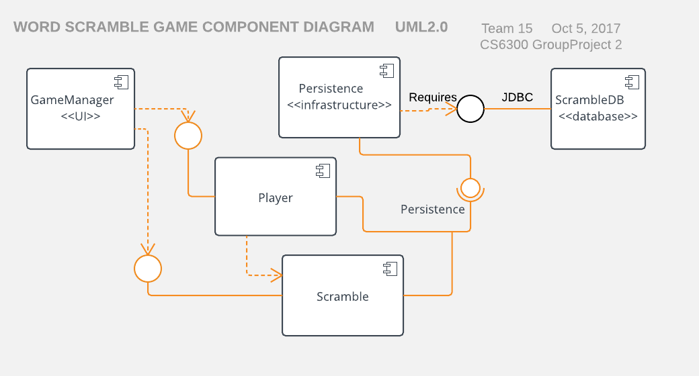
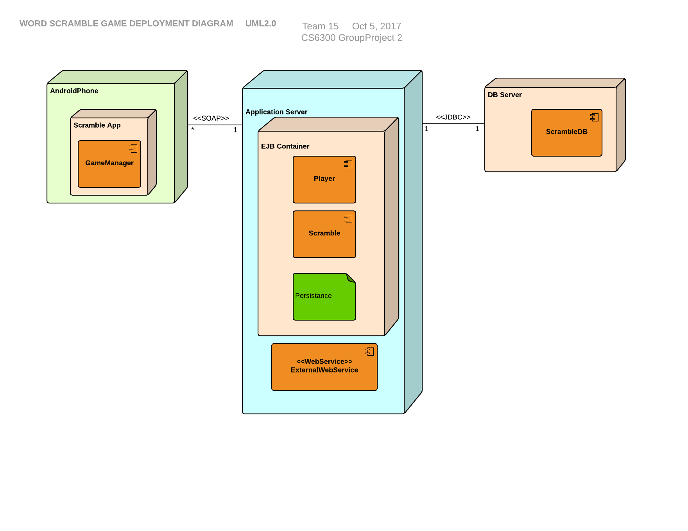
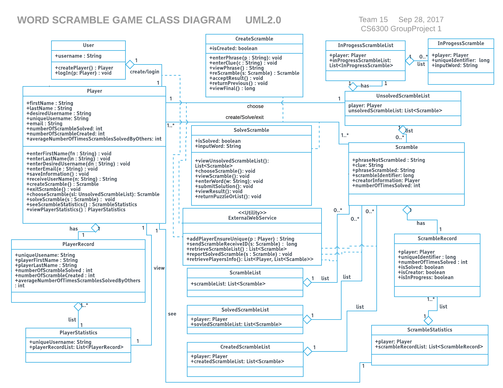
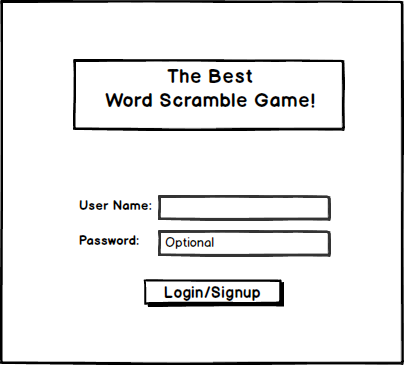
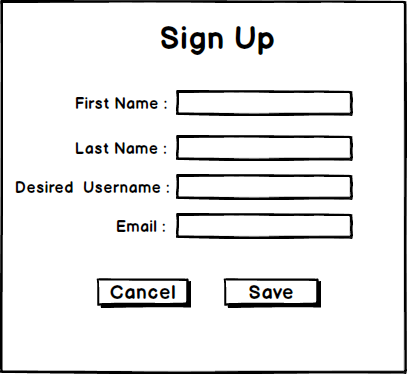
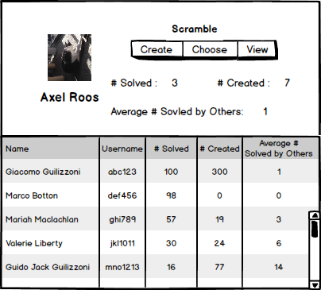
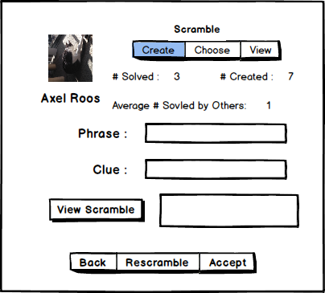
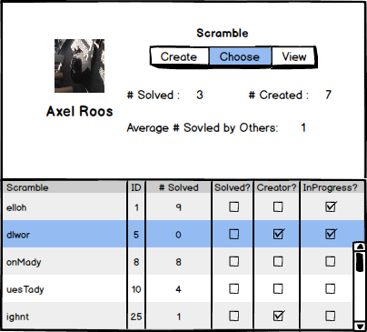
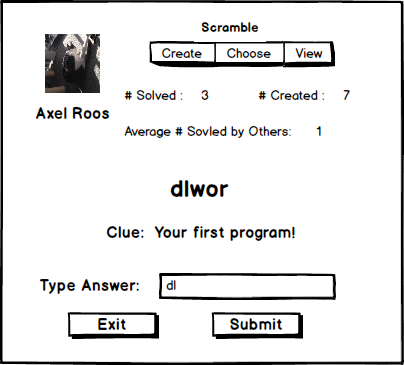
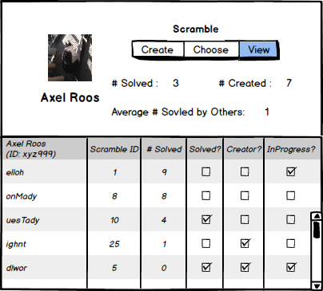

# Design Document

**Author**: Fang Wang \<Team 15\>

Developing an Word Scramble Game app for the Android OS following a Unified Software Process model.

## 1 Design Considerations

### 1.1 Assumptions

The background of the software is that our customer, Axel Roos, has approached that it would be a nice diversion to have an application where they can (1) solve word scrambles, (2) create word scrambles, and (3) compare their progress. This app game is used to kill endless free time of players. The software is an Android App. It has user log-in UI and main function UI, also with appropriate data storage. The operational environment can be on Android Emulator or real Android device (phone or tablet).  The significant project issues include how to achieve the basic function, how to store the data and retrieve data after exit and return to game, and how to compare players' progress.

### 1.2 Constraints

Technical constraints include: programming language should be Java; Operating system or platform should be Android. The client can only compare his performance with others by log in the account and check the player statistics, which is listed in decreasing number of scrambles solved.

### 1.3 System Environment

The hardware the system operate in is Android device or emulator. The software the system operate in is Android Studio.

## 2 Architectural Design

There is a basic client server interaction. The design includes two main packages: one for the client and one for the server.

### 2.1 Component Diagram

The Component Diagram includes: User interface, Player and Scramble component, Persistence service and database. The reference is [here](http://www.agilemodeling.com/artifacts/componentDiagram.htm).

### 2.2 Deployment Diagram

The deployment diagram includes: AndroidPhone, Application Server, DB Server. The reference are as follows:
[reference 1](https://pl.cs.jhu.edu/oose/projects/examples/10-group1/Iteration2.html), [reference 2](http://agilemodeling.com/style/deploymentDiagram.htm).

## 3 Low-Level Design

### Class Diagram

## 4 User Interface Design

1. Log in

2. Create New Player

3. Player account with Player Statistics displayed. The list of players are sorted by decreasing number of scrambles the player has solved.

4. Create a new scramble. You can always go back or rescramble it before you accept it.

5. Choose a scramble to solve. Notice that the in progress scrambles are listed before the other unsolved scrambles.

6. Solve a scramble. You can submit your answer or exit it.

7. View scramble statistics. Notice that the list is sorted by decreasing number of solutions.

## 5 What's new
* 2017-10-14: Some class attribute types are modified and some methods described in *UseCaseModel.md* are not used to simplify the system.
* 2017-10-13: EWS is firstly downloaded. Then, we created a new directory named *libs*, where we add EWS as a library. Next, we can change the path under the *build.gradle*. 
