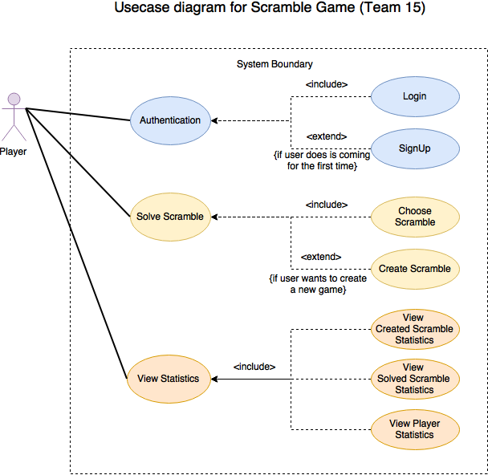
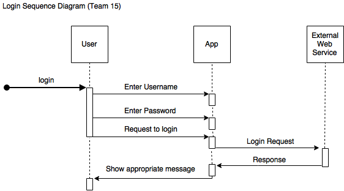
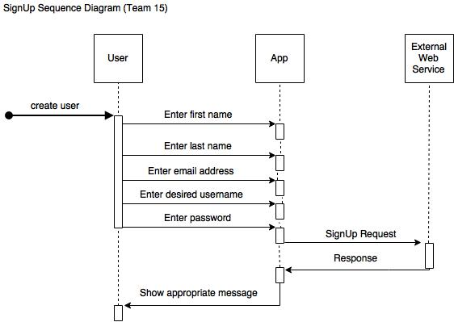

# Use Case Model

Use case model is used to represent various use cases of the software. In our case, we will be representing the multiple use cases of Scramble Application.

**Author**: Team 15

## 1 Use Case Diagram

*Figure 1 - Use case diagram - Scramble game*

## 2 Use Case Descriptions

Scramble app at this stage has just one actor at any instance. We will call this actor as player of the game. Following are the different possible use cases for this game: 

**1. Authorisation Use case:**

- **Requirements:** Autorisation use case is responsible for authorisation the user. In happy case, user can enter his username and password to authorise himself. But in case, he is coming to the application for the first time, this use case can be extended to create user use case as well, we are calling it signup use case.
- **Pre-conditions:** User not verified by the appication.
- **Post-conditions:** Authorise the user to enter the application. Have the valid username using which currently logged in user can be idenfied.
- **Scenarios:** Once user will start the application, he can either choose to login via previously created account or choose to register and create a new user. Following sequence diagrams explains the scenario's in detail:

*Figure 2 - Sequence Diagram - Authorisation with Login*

*Figure 3 - Sequence Diagram - Authorisation with SignUp*

**2. Play scramble Use case:**
- **Requirements:** Sencond major use of this application is to allow an user to play the scramble game. In happy case, use can choose a game from the list of scramble games and play the game. In case, user wants to create a new game, he choose to extend this use case to create game use case.
- **Pre-conditions:** User wants to play a game.
- **Post-conditions:** User should be able to play scramble game.
- **Scenarios:** This use case helps an user to play the scramble game. If wants to play a game, he can choose one of the scramble puzzle from this list of puzzles and start a game. Or else he can choose to extent the use case and create a new game himself.

**3. View Statistics Use case:**
- **Requirements:** Last and final use case of this application is to view statistics. User can choose to view statistics. He can either view the statistics of his own created game, or a game he is solved, or statistics of a player.
- **Pre-conditions:** User wanting to view statistics.
- **Post-conditions:** User should be able to view and analyse statistics.
- **Scenarios:** This use case helps the user to view the statistics of the game. User can choose to view the statistics of the game created himself, or of a game he has solved, or he can choose to view the statistics of any player by choosing from the list of player. List of player will display first name and last name of all the players.
