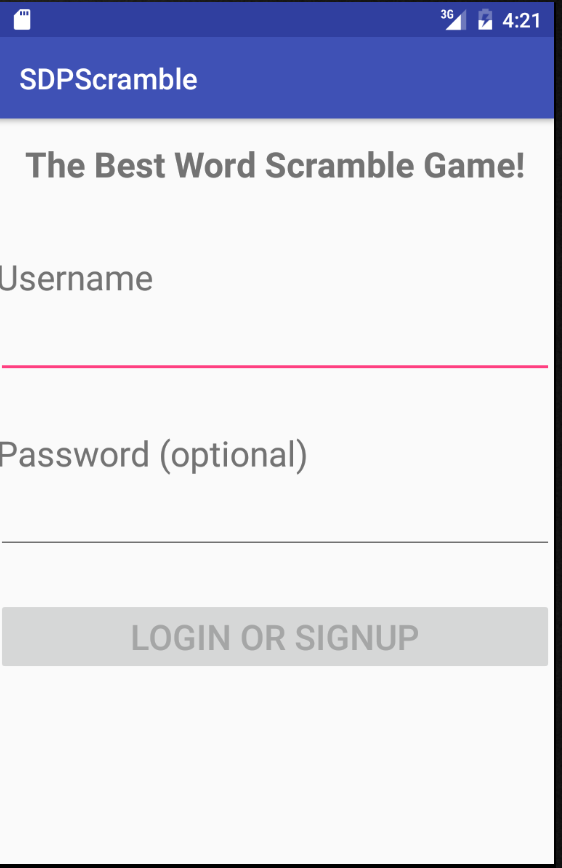
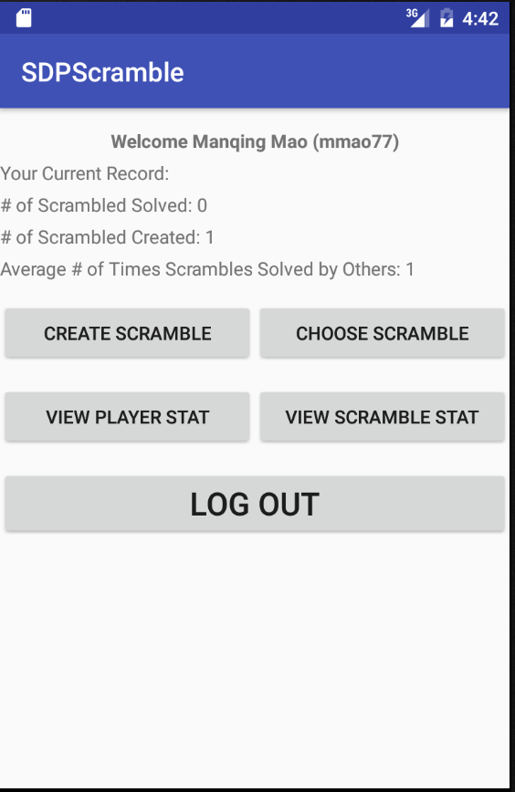
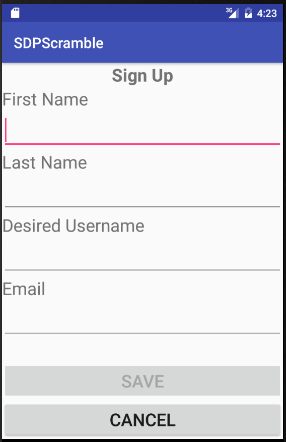
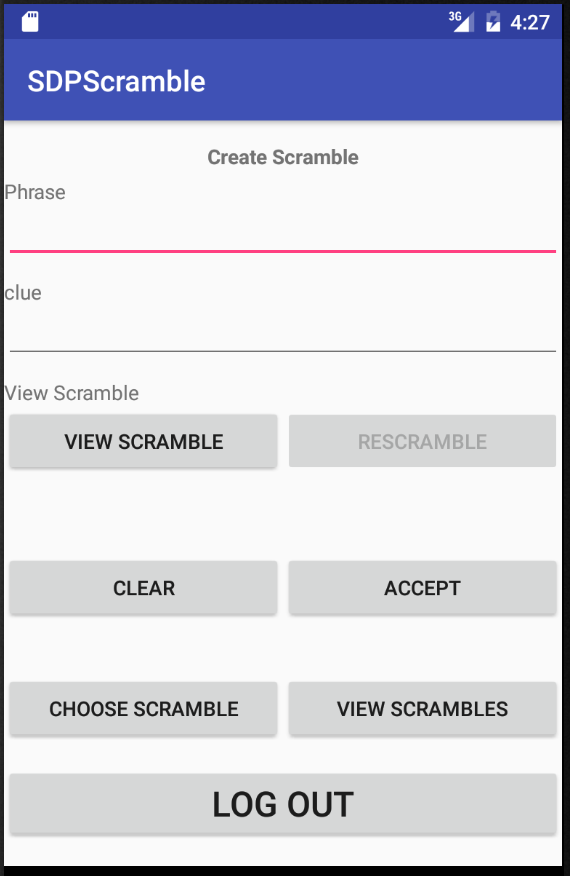
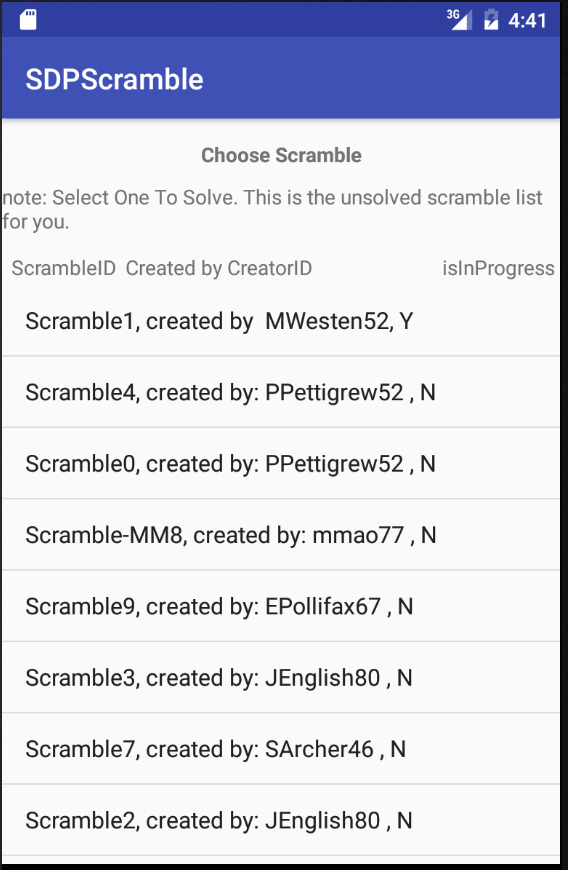
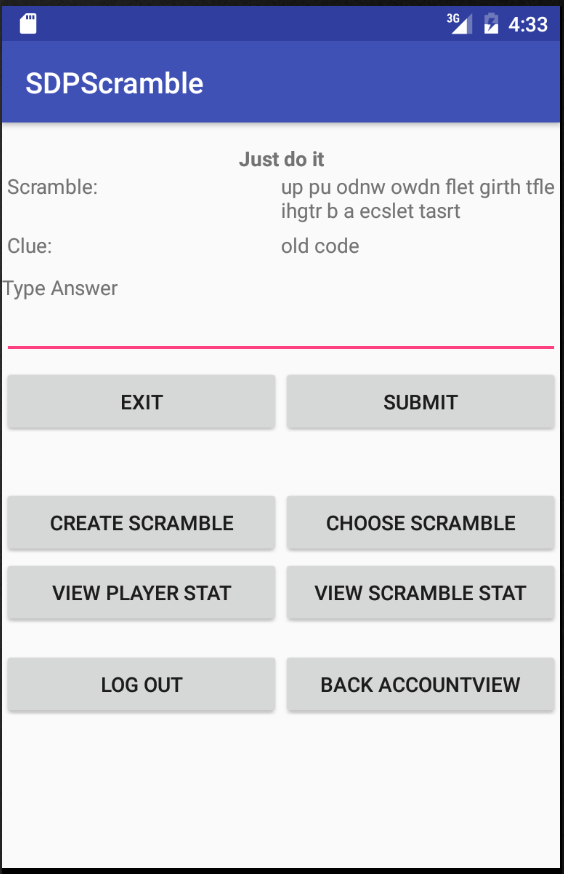
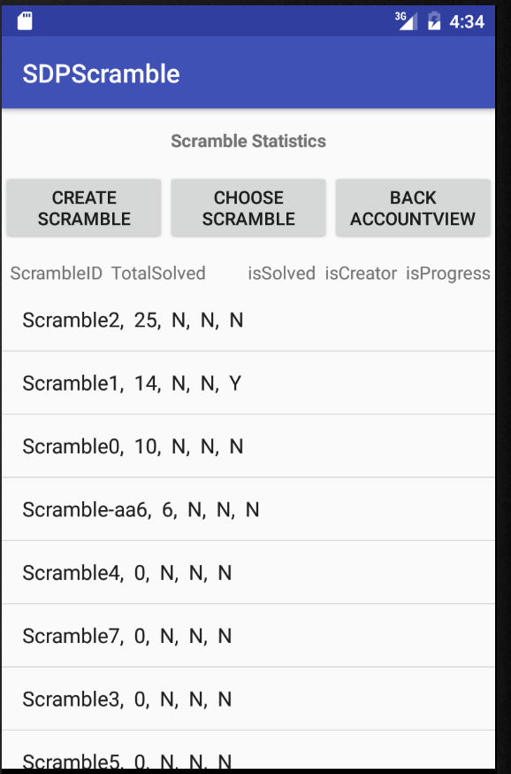
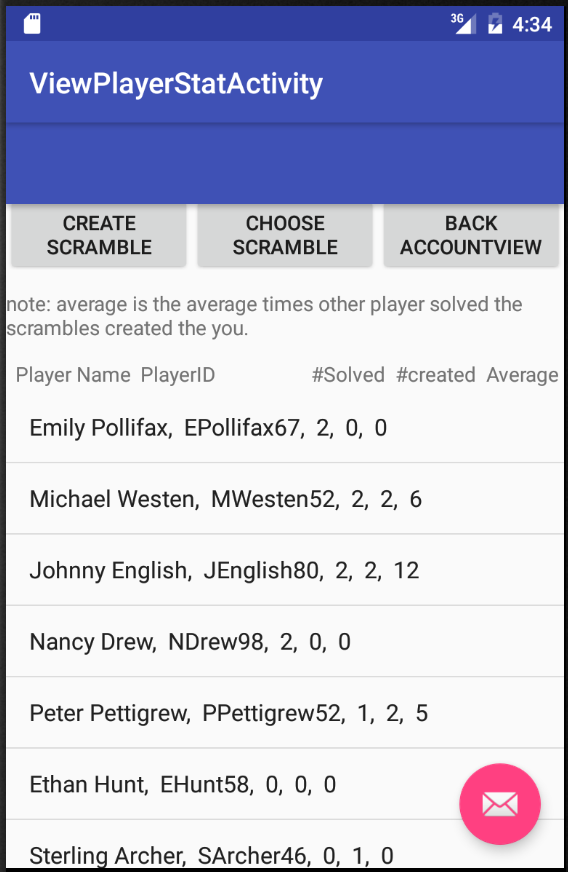

# SDPScramble User Manual

**Author**: Manqing Mao (Team 15), Feng Xiao

## Introduction

The SDPScramble is a mobile Android application for players to create and solve scrambles. The user can DIY scrambles and solve puzzle scrambles. This maunual shows how a user plays with SDPScramble game with respect to following aspects:

* Authentication
* Create scrambles
* Solve scrambles
* View scrambles statistics

## externalwebservice (EWS)
An externalwebservice.jar needs to be imported as a black-box to read and write i/o. externalwebservice.jar needs to be imported into project folder, with appropriate build.gradle settings. GitHub does not hold ews file.

## 1 Authentication
The screen below allows you to sign in if you have an username or sign up if you do not have one.

1) Input an username to sign in or sign up.  
2) Click the *Login/Signup* icon at the bottom of the screen, which would open the player account interface (as shown below) if the username is valid.
* In your account, you can see your individual statistics (current record): the number of scrambles you created, the number of scrambles you solved and average number of scrambles you have not solved but solved by other players.
* In your account, you can also choose four functions: create scramble, choose scramble, view palyer statistics and view scramble statistics. These will be described in the following sections.

3) You are asked to sign up if the input username is invalid. Clicking the *Login/Signup* icon opens *Sign up* interface, as shown below.
* Input your first name, last name, desired username and email;
* Click the *Save* icon at the bottom of the screen to continue, otherwise Click the *Cancel* icon if you want to go back to *Login* interface.

## 2 Create Scrambles
After log-in, the user can create scrambles by choosing the *Create* functional icon, which opens *Create Scrambles* interface, as shown in below.

1) Input phrase and clue.   
2) Click *View Scramble* icon to see the scramble you created.  
3) Click *Accept* icon to at the bottom of the screen if you like the scramble, otherwise click *Rescramble* icon. Feel free to rescramble unlimited times until you feel satisfied. Click *Clear* icon to delete what you input.

## 3 Solve Scrambles
After log-in, the user can choose and solve scrambles by choosing the *Choose* functional icon, which opens *Choose Scrambles* interface, as shown in below.

1) Pick one scramble by clicking it.    
2) After choosing a scramble, *Solve Scrambles* interface opens, as shown below. Input your answer.    
3) Click *Submit* icon to at the bottom of the screen if are ready to submit. Then, you can see the result (correct or wrong). You can quit anytime by clicking *Exit* icon. The App will automatically save your status.

## 4 View Statistics

After log-in, the user can view scramble or player statistics.

#### 4.1 View Scrambles Statistics
Click *View Scramble Stat* icon to see the scrambles statistics. You can always go back to your account by clicking *Back AccountView* icon.  
* The scramble statistics shall let you see the list of all scrambles with (1) their unique identifier, (2) information on whether they were solved or created by the player, and (3) the number of times any player has solved them. This list shall be sorted by decreasing number of solutions.

#### 4.2 View Players Statistics
Click *View Player Stat* icon to see the players statistics. You can always go back to your account by clicking *Back AccountView* icon.
* The player statistics shall let you see the list of all players’ first names and last names, with (1) the number of scrambles that the player has solved, (2) the number of new scrambles created, and (3) the average number of times that the scrambles they created have been solved by other players. It will be sorted by decreasing number of scrambles that the player has solved.

